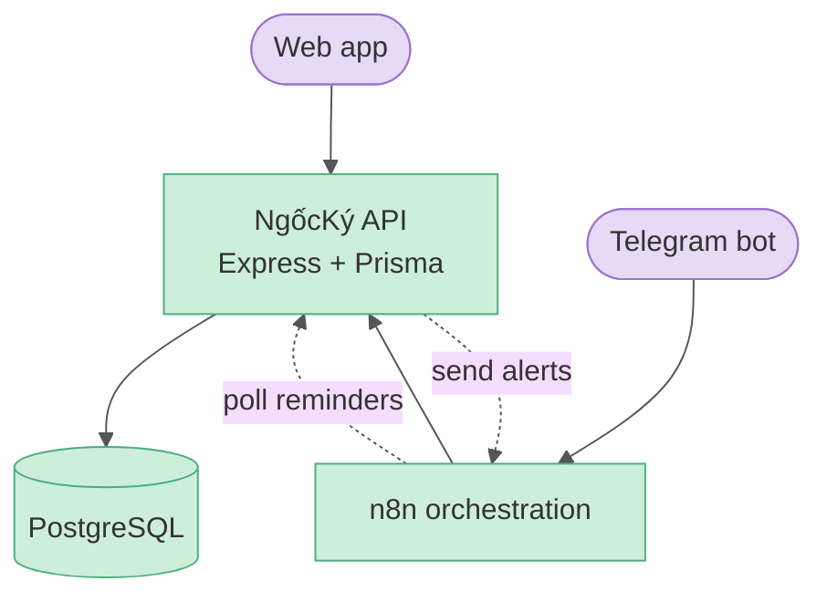

# NgốcKý

**Status:** live  ·  **Owner:** Kael (cong.bui)  ·  **Audience:** my family + future-me

NgốcKý is a private family record-management hub: one place to track personal/household
tasks, goals, calendar events, expenses, hobbies, and health records — with a Telegram
assistant as an alternate way to log and query things from my phone. It runs as a
self-hosted web app on my VPS at `ngocky.kael.io.vn`.

> "Kaelio" is just my template codename for projects; the actual product is **NgốcKý**.

## At a glance
- **What it does:** family hub for tasks, goals, expenses, calendar, hobbies, and health records, with reminders and a Telegram bot.
- **Who uses it:** me and my family (OWNER / ADMIN / USER roles, per-item sharing).
- **Stack:** React + Vite frontend · Express + Prisma + PostgreSQL API · Docker + Caddy on a VPS · n8n + Telegram for assistant/reminders.

## Hero diagram

## Read next
- [Origin / why I built it](01-origin.md)
- [Timeline](02-timeline.md)
- [Architecture](03-architecture.md)
- [Lessons / read this if I restart](lessons.md)
