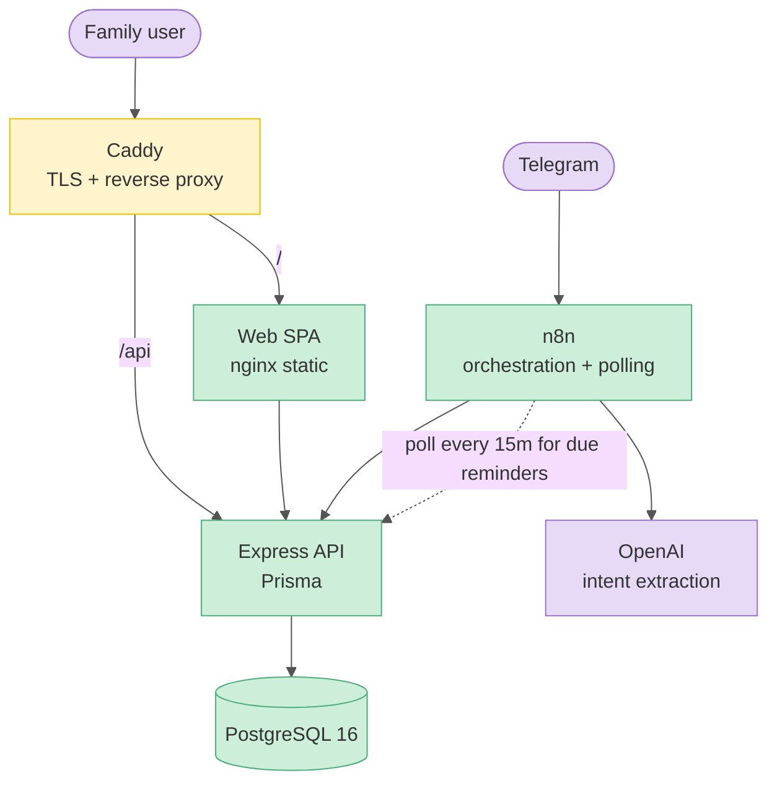
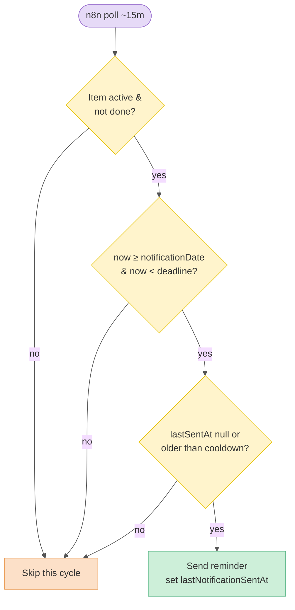

# Architecture

Deep-tech tier. How NgốcKý is built, deployed, and how data flows.

## Tech stack
| Layer | Tech |
|-------|------|
| Frontend | React 19, Vite, TypeScript, Tailwind CSS, React Router 7, TanStack Query, Zustand, Recharts, Axios, lucide-react |
| Backend | Node.js 20, Express, TypeScript, Prisma 6, Zod, JWT |
| Database | PostgreSQL 16 |
| Assistant/automation | Telegram bot → n8n → API; OpenAI for intent extraction |
| Infra | Docker, GitHub Actions → GHCR, Caddy (TLS/reverse proxy), PM2 (process mgmt) |

## Monorepo layout
npm workspaces — no shared packages; types/utilities are duplicated across apps where needed.
- `apps/api` — Express backend. Entry `src/index.ts` (connect DB, seed owner, listen on 3001).
  App wiring in `src/app.ts`. Routes in `src/routes/` (~23 files, one per module). Middleware:
  `auth.ts` (JWT + role), `validate.ts` (Zod), `errorHandler.ts`, `assistantAuth.ts` (n8n key).
  Singleton Prisma client in `src/config/database.ts`; all env via `src/config/env.ts`.
- `apps/web` — React frontend. Entry `src/main.tsx` → `src/App.tsx` (router + TanStack Query).
  API calls in `src/api/` (Axios client + auth interceptor). State: Zustand in `src/stores/`
  for auth/UI, server state via TanStack Query. `@/` alias → `src/`. Tailwind-only styling.

## System map

## Request / auth flow
- **Access token** (short-lived, `JWT_EXPIRY`) stored in `localStorage`, sent as
  `Authorization: Bearer`.
- **Refresh token** (long-lived, `JWT_REFRESH_EXPIRY`, ~7d) in an HTTP-only Secure cookie
  scoped to `/api/auth`; rotation on refresh.
- Roles: `OWNER > ADMIN > USER`, enforced by `requireRole` middleware.
- Frontend refresh logic skips `/auth/login|logout|refresh` so auth failures surface
  instead of looking like an instant sign-out.
- All inputs validated by Zod via `validate(schema)` before handlers.

## Reminder data flow (why it doesn't spam)
The API/DB is the source of truth; n8n only polls and delivers.

## Key design constraints
- **Module ownership:** each module is the source of truth for its domain. Cross-module
  automation is allowed only when one record is clearly derived from another's
  completion/scheduling (e.g. payment Task → Expense, Maintenance → Expense/Calendar,
  Fund buy/sell → Keyboard). Derived records store a link to avoid duplicates.
- **Records vs events vs deadline-items:** Expenses/Funds/logs are *records* (shown by
  time range, no overdue logic); Calendar items are *events*; only `ProjectTask.deadline`
  and `HouseworkItem.nextDueDate` drive overdue feeds.
- **Reminders are always pre-deadline/pre-start**, never post-deadline; overdue handling
  lives in Reports & Notifications.
- **Sharing:** `isShared` makes an item visible to all but does **not** grant edit/delete;
  non-owners see `Owner: <name>`.
- **VND money:** integer VND, no decimals; shorthand input (`600k`, `82M`); format with
  `toLocaleString('vi-VN')`.
- **Telegram boundary:** Telegram is the channel, n8n is transport, the LLM only extracts
  intent — the API owns identity, authz, validation, execution, and audit.

## Deployment / CI-CD
GitHub Actions on push to `main`: build Docker images → push to GHCR → SSH to VPS →
write `.env` from GitHub Secrets → pull images → run Prisma migrations → seed owner →
bring up containers. Web served via nginx (SPA fallback + `/api` proxy); Caddy terminates
TLS. Dev note: localhost web may be pointed at the VPS API, so backend changes only show
locally after a VPS deploy in that setup. See [reference/](reference/) for env vars and
setup steps.

## Read next
- [Per-feature design docs](design/) · [Diagrams](diagrams/) · [Reference & how-tos](reference/)
- [Lessons](lessons.md)
